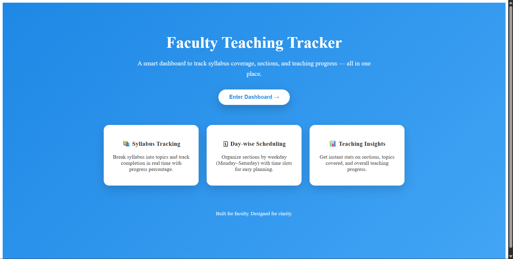
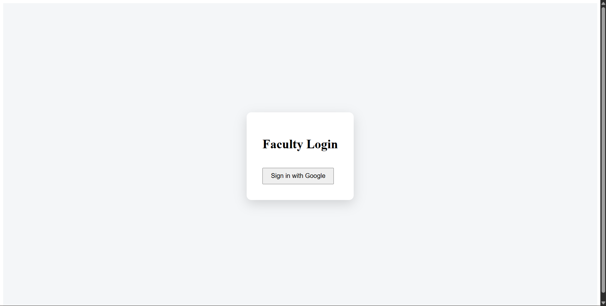
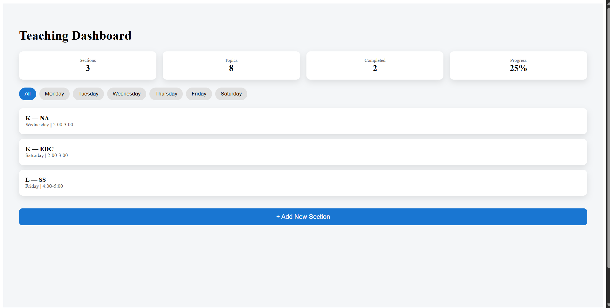
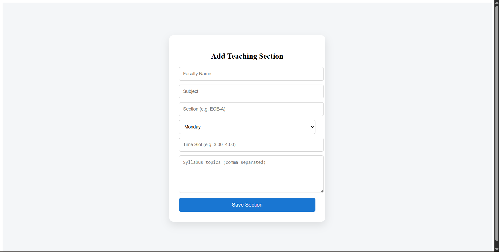
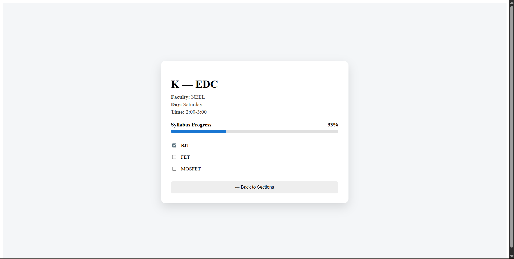

# Faculty Teaching Tracker

## 🚩 Problem Statement
Educational institutions lack a centralized digital system for faculty to manage teaching sections, track syllabus completion, and monitor day-wise teaching progress. Existing manual or semi-digital methods are inefficient, fragmented, and fail to provide real-time visibility into teaching progress.

---

## 💡 Solution Overview
Faculty Teaching Tracker is a web-based dashboard that allows faculty members to securely log in, manage teaching sections, track syllabus coverage topic-wise, and view overall teaching progress in real time. The platform replaces manual tracking with a structured, digital, and intuitive system.

---

## ❓ How is this different from existing solutions?
- Most existing systems are **manual, spreadsheet-based, or fragmented**
- No real-time progress tracking per topic
- No faculty-centric dashboard

This solution:
- Centralizes all teaching data in one place
- Tracks syllabus completion live
- Provides day-wise scheduling and insights
- Uses secure Google authentication

---

## 🛠 How does it solve the problem?
- Faculty log in using Google Sign-In
- Teaching sections are stored centrally in Firestore
- Syllabus topics can be marked completed in real time
- Progress percentage is auto-calculated
- Day-wise filtering improves planning and visibility

---

## ✨ Features
- Google Authentication (Faculty Login)
- Protected Routes (Only logged-in users can access data)
- Add / View Teaching Sections
- Day-wise section filtering (Monday–Saturday)
- Topic-wise syllabus completion tracking
- Automatic progress calculation
- Real-time data storage using Firestore
- Responsive and clean UI

---

## 🔧 Google Technologies Used
- **Firebase Authentication** – Google Sign-In
- **Cloud Firestore** – Real-time NoSQL database
- **Firebase Hosting** – Deployment of the web app
- **Google Cloud Platform (via Firebase)**

---

## 🚀 MVP (Minimum Viable Product)
The MVP demonstrates:
- Secure faculty login
- Section creation
- Syllabus tracking
- Progress visualization
- Live cloud deployment

---

## 🌐 MVP Live Link
👉 https://faculty-teaching-tracker-bc35d.web.app

---

## 📸 MVP Screenshots
# Faculty Teaching Tracker

## 🚩 Problem Statement
Educational institutions lack a centralized digital system for faculty to manage teaching sections, track syllabus completion, and monitor day-wise teaching progress. Existing manual or semi-digital methods are inefficient, fragmented, and fail to provide real-time visibility into teaching progress.

---

## 💡 Solution Overview
Faculty Teaching Tracker is a web-based dashboard that allows faculty members to securely log in, manage teaching sections, track syllabus coverage topic-wise, and view overall teaching progress in real time. The platform replaces manual tracking with a structured, digital, and intuitive system.

---

## ❓ How is this different from existing solutions?
- Most existing systems are **manual, spreadsheet-based, or fragmented**
- No real-time progress tracking per topic
- No faculty-centric dashboard

This solution:
- Centralizes all teaching data in one place
- Tracks syllabus completion live
- Provides day-wise scheduling and insights
- Uses secure Google authentication

---

## 🛠 How does it solve the problem?
- Faculty log in using Google Sign-In
- Teaching sections are stored centrally in Firestore
- Syllabus topics can be marked completed in real time
- Progress percentage is auto-calculated
- Day-wise filtering improves planning and visibility

---

## ✨ Features
- Google Authentication (Faculty Login)
- Protected Routes (Only logged-in users can access data)
- Add / View Teaching Sections
- Day-wise section filtering (Monday–Saturday)
- Topic-wise syllabus completion tracking
- Automatic progress calculation
- Real-time data storage using Firestore
- Responsive and clean UI

---

## 🔧 Google Technologies Used
- **Firebase Authentication** – Google Sign-In
- **Cloud Firestore** – Real-time NoSQL database
- **Firebase Hosting** – Deployment of the web app
- **Google Cloud Platform (via Firebase)**

---

## 🚀 MVP (Minimum Viable Product)
The MVP demonstrates:
- Secure faculty login
- Section creation
- Syllabus tracking
- Progress visualization
- Live cloud deployment

---

## 🌐 MVP Live Link
👉 https://faculty-teaching-tracker-bc35d.web.app

---

## 📸 MVP Screenshots

### Landing Page


### Faculty Login


### Teaching Dashboard


### Add Teaching Section


### Syllabus Progress Tracking


---

## 🧑‍💻 Tech Stack
- React.js
- Firebase (Auth, Firestore, Hosting)
- JavaScript
- HTML/CSS

---

## 📌 How to Run Locally
```bash
npm install
npm start

### Faculty Login


---

## 🧑‍💻 Tech Stack
- React.js
- Firebase (Auth, Firestore, Hosting)
- JavaScript
- HTML/CSS

---

## 📌 How to Run Locally
```bash
npm install
npm start
